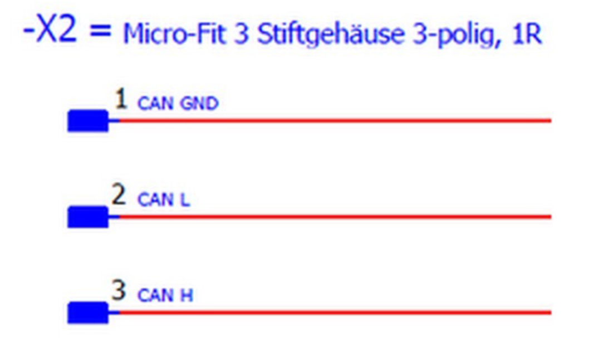
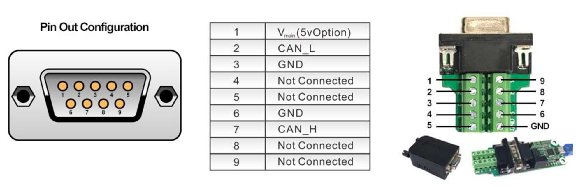
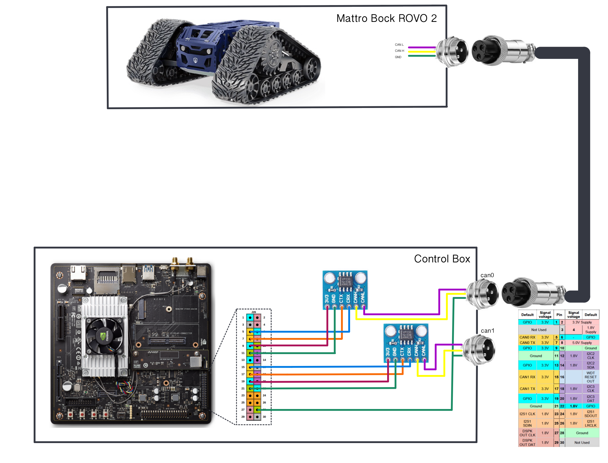

# Mattro Bock ROVO 2

## CAN communication

Custom connector: DB9 serial connector

PIN:

2 &rarr; Purple &rarr; CAN L

3 &rarr; Blue &rarr; GND

7 &rarr; White &rarr; CAN H





## Robot speed


where:

 is the speed of the robot in [km/h]

 is the wheel diameter &rarr; 0.35 for heavy duty version

 is the gear ratio &rarr; 7 or 16

Speed is expressed in percentage from 0 up to 1000, where the 1000% corresponds to the maximum speed which is 

## Jeston TX2 CAN Communication



<ins> Requirements </ins>

- Nvidia Jetson TX2 Developer Board
- Flash Jetson TX2 with Jetpack 3.2
- Jumper wires
- 120 ohm resistor (optional)
- Transceivers (up to 2 for 2 CAN bus ports). For example: [Waveshare transceiver](https://www.amazon.com/gp/product/B00KM6XMXO/ref=as_li_tl?ie=UTF8&camp=1789&creative=9325&creativeASIN=B00KM6XMXO&linkCode=as2&tag=scratchroboti-20&linkId=d13fb19443698b5fee1d20a7122008e3)


<ins> How to wire </ins>

The Jetson TX2 developer board comes with 2 CAN controllers, hence one can have 2 different CAN ports by using 2 transceivers connecting to these CAN controllers.

Locate J26 / GPIO Expansion Header and its pin. You can find the spec of these pins on the Jetson TX2 Dev Kit Carrier Board Specification document at this [link](https://developer.nvidia.com/embedded/downloads) , all the documents are free to download but require a login.

***Connecting Jetson & Transceiver***

**Can0**

> Pin 5 <-> CAN RX

> Pin 7 <-> CAN TX

> GND <-> GND

> 3.3v <-> 3.3


**Can1**

> Pin 15 <-> CAN RX

> Pin 17 <-> CAN TX

> GND <-> GND

> 3.3v <-> 3.3

<ins>Commands</ins>

If using Jetpack 3.2 or later, you won’t have to worry about enabling header for mttcan, this seems like a missing thing from earlier Jetpack version.

In a terminal, type following commands to setup CAN channels and their bitrate. The bitrate here is 500K but one can change to other numbers per  your need. I did test up to 1 million bit-rate.

```
sudo modprobe can
sudo modprobe can_raw
sudo modprobe mttcan
sudo ip link set can0 type can bitrate 500000
sudo ip link set up can0
sudo ip link set can1 type can bitrate 500000
sudo ip link set up can1
```

In another terminal, check if the CAN bus are set up

```
ifconfig
```

Install can-ultils to send and receive CAN message over terminal

```
sudo apt-get install can-utils
```

<ins>Example send & receive can message </ins>

For example, you connect both can0 to can1 together. You want to send a sample message from can0 and receive from can1.

In one terminal, run:

```
candump can1
```

In another terminal, run, for example:

```
cansend can0 01a#11223344AABBCCDD
```

If the message was sent successfully, you will see the message on can1’s terminal

<ins> Possible Error </ins>

The transceiver do not come with a terminal resistor (120 ohm) built-in. If the other CAN device you connect to also does not have the terminal resistor, you need to insert one into the system to get the message flow through. Otherwise, all messages would go into error state.

## References

- [Innomaker USB to CAN Converter Module](https://www.amazon.it/Modulo-convertitore-USB-Raspberry-Zero/dp/B07Q812QK8/ref=sr_1_7?keywords=can+usb+adapter&qid=1647593956&sprefix=USB+CAN+adap%2Caps%2C79&sr=8-7)
- [Innomaker website](http://wiki.inno-maker.com/)
- [Nvidia forum 1](https://devtalk.nvidia.com/default/topic/1025010/jetson-tx2/how-to-use-can-on-jetson-tx2-/)
- [Nivida forum 2](https://devtalk.nvidia.com/default/topic/1006762/jetson-tx2/how-can-i-use-can-bus-in-tx2-/3)
- [SG Framework](https://sgframework.readthedocs.io/en/latest/cantutorial.html)
